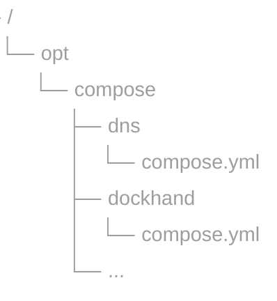

# Plan général

Nous allons pendant ce TP mettre en oeuvre l'ensemble des éléments d'une PKI puis un IdP pour permettre l'authentification.
Même si un certain nombre de principe de sécurité ont été respectés, il y a aussi des parties non mises en oeuvre. On peut citer :
  - un FW et un WAF en frontal de tout cela
  - un bastion d'administration
  - des images non hardenées même si elle viennent principalement validées par les éditeurs
  - une PKI sans CP ni CPS.
  - des dockers qui tournent pour certains en tant que root
  - ....

Nous allons monter au fur et à mesure de ce TP une infrastructure de ce type :


# Prerequis

Vous avez à votre disposition, chacun une VM Ubuntu Server sur proxmox
Nous allons installer docker pour faire tourner plusieurs containers
  - Installation de Docker
    - Tutoriel possible : https://www.hostinger.com/fr/tutoriels/docker-c-est-quoi
    - installation de docker et docker-compose
      - docker : https://docs.docker.com/engine/install/ubuntu/
      - le plugin docker-compose : https://docs.docker.com/compose/install/linux/ 
  - Commandes utilisées très souvent par la suite :
    - Pour mettre à jour l'image, arrêter le container actuel et relancer :

      ``` sudo docker compose pull && sudo docker compose stop && sudo docker compose up -d --remove-orphans ```
      
    - Si besoin de construire l'image :
    
     ``` sudo docker compose build ```
    
  - Mise en oeuvre des premiers containers    
    - un dns + nom de domaine (à changer)
    - dockhand : pour avoir un visuel facile sur les différents containers
    - mailhog : pour pouvoir récupérer tous les mails qui partent
    - un Caddy : pour agir comme reverse proxy
    - 3 applications (simpleSAML, Dashy, Python headers)


## Installation Docker & docker compose
Nous allons tout d'abord installé Docker sur notre VM ubuntu. Pour cela nous allons suivre ce tutoriel : https://docs.docker.com/engine/install/ubuntu/
Leplugin compose est bien inclus dans l'installation apt : docker-compose-plugin
Confirmation que le docker tourne bien avec cette commande  ``` sudo docker run hello-world ```
La sortie devrait être de ce type :

```
Hello from Docker!
This message shows that your installation appears to be working correctly.
```

## Organisation des configurations
Nous allons dédier un répertoire sous opt à la création de nos containers.
Ce répertoire est interressant à sauvegarder mais attention il pourra aussi contenir des secrets.
Chaque container sera défini dans un sous répertoire ce qui permet sa configuration simple.


## initialisation des différents réseaux

Nous allons créer 3 zones différentes.
A l'interieur de chacun de ces réseaux, les flux ne sont pas filtrés, mais ils ne sont pas possibles entre réseaux.
Pour la faisabilité du TP, les containers qui devront être accéssibles vis plusieurs réseaux sont raccordées à tous les réseaux mais il serait certainement mieux de faire des règles FW spécifiques.
pour créer ces zones, nous allons lancer ces commandes :

```
sudo docker network create --driver=bridge --subnet=192.168.101.0/25 NetApp
sudo docker network create --driver=bridge --subnet=192.168.101.128/25 NetAuth
sudo docker network create --driver=bridge --subnet=192.168.102.128/25 NetAdmin
sudo docker network create --driver=bridge --subnet=192.168.102.0/25 NetAccess

```


## installation des premières machines
Nous allons utiliser deux fichiers tar comprenant l'ensemble des fichiers.
Ils seront dispo sur github, le moddle ou autre....

### le DNS
Le but de ce dns est de répondre aux requêtes DNS pour l'ensemble du TP.
Nous allons donc le configurer pour une zone tpiam.internal - vous pouvez personnaliser ce nom de zone, cela permettra aussi de faire des liens entre TP.
Il faut aussi prévoir que pendant le tp, vos postes clients puissent toujours interroger le DNS de l'école ou l'externe. Les postes clients n'ayant que rarement la possibilité d'avoir plusieurs formard, nous allons créer un forward DNS.

Voici donc les fichiers à mettre en oeuvre sous /opt/docker-compose/dns/

compose.yml :
 ```
services:
  coredns:
    image: coredns/coredns:latest
    container_name: coredns
    command: -conf /etc/coredns/Corefile -dns.port 53
    ports:
      - "53:53"
      - "53:53/udp"
      #- "8080:8080"
    volumes:
      - ./Corefile:/etc/coredns/Corefile
      - ./db.tpiam.internal:/etc/coredns/db.tpiam.internal
    networks:
      - NetAccess

networks:
  NetAccess :
    external: true 
 ```

Ce fichier permet donc une exposition du port 53, un montage des deux fichiers de configuration dans le réseau NetAccess

Corefile :
```
.:53 {
    forward . 86.54.11.1
    log
    errors
    health :8080
}

tpiam.internal:53 {
    file /etc/coredns/db.tpiam.internal
    log
    errors
```
ce Corefile donne le comportement du dns pour les differentes zones. pour nous tpiam.internal et le reste.
Le serveur 86.54.11.1 est le DNS d'initiative européenne DNS4EU : https://joindns4.eu/

db.tpiam.internal
```
$ORIGIN tpiam.internal.
@         IN  SOA dns.tpiam.internal. prof.tpiam.internal. 2604242302 7200 3600 1209600 3600
dns       IN  A   172.16.20.2 #A remplacer
portail   IN  CNAME   dns
dashy     IN  CNAME   dns
simpleapp IN  CNAME   dns
dockhand  IN  CNAME   dns
idp       IN  CNAME   dns
mail      IN  CNAME   dns
```
Dans ce fichier n'oubliez pas de gérer le numéro de série (toujours croissant), cela permet la prise en compte de la nouvelle configuration.
La convention est d'utiliser YYMMDDHHmm pour ce numéro.
et vous pourrez voir dans les logs : ``` [coredns] 2026-05-03T05:44:24.526381257Z [INFO] plugin/file: Successfully reloaded zone "tpiam.internal." in "/etc/coredns/db.tpiam.internal" with 2605030740 SOA serial ```

Lancer le container
Nous allons maintenant tester ce dns. 
Attention, il semble qu'un DNS puisse être en place sur la machine fournie. Dans ce cas, il faut l'arrêter et le désactiver... 
```
sudo systemctl start systemd-resolved
sudo systemctl start systemd-resolved
```
et voir quels ports sont utilisés
```
sudo lsof -i -P -n | grep LISTEN
```

Sous windows, lancer une invite de commande et taper nslookup, changer ensuite de serveur ``` server XXX.XXX.XXX.XXX ``` en remplaçant par l'adresse IP de votre vm; selon le nom de domaine choisi, vérifier la résolution de nom de domaine, tester aussi des noms de domaine externes ou des noms de domaine de l'école. 
Merci aussi de mettre à jour la résolution DNS de votre poste de travail (et ne pas oublier de revenir la configuration initiale par la suite....) - en VPN la connexion peut être dans les paramètres réseaux avancées puis les paramètres supplémentaires....

### Dockhand
cette interface web, comporable à portainer ou d'autres, permet de gérer les images, containers, réseaux de docker...
Nous l'utiliserons principalement pour visualiser les containers, avoir une console ou voir les logs.
pour l'installer créer ce fichier sous /opt/docker-compose/dockhand/ :
```
services:
  dockhand:
    image: fnsys/dockhand:latest
    container_name: dockhand
    restart: unless-stopped
    ports:
      - 3001:3000
    volumes:
      - /var/run/docker.sock:/var/run/docker.sock
      - dockhand_data:/app/data
    networks:
      - NetAdmin
networks:
  NetAdmin :
    external: true

volumes:
  dockhand_data:
```
Lancer le container
On va maintenant faire la première configuration de dockerhand.
Le port 3001 a été publié, donc on va s'y connecter via notre navigateur : http://dockhand.tpiam.internal:3001
Attention ce site est en http pour le moment.
Il faut à minima se raccorder à l'environnement local : Settings, tab environments, créer un nouvel environnement avec Unix Socket comme type de connexion.

> **Pour aller plus loin** : mettre en place la possibilité de scanner les vulnérabilités des images.

### caddy
Caddy est un reverse proxy et serveur web comme Traefik, Nginx ou Apache. Il se distingue aujourd'hui pour sa simplicité et son https automatique.
voici la configuration initiale que nous allons utiliser 
compose.yml :
```
volumes:
  data:
  config:

services:
  caddy:
    image : caddy:latest
    ports:
      - 80:80
      - 443:443
    volumes:
      - ./Caddyfile:/etc/caddy/Caddyfile:ro
      - data:/data
      - config:/config
    restart: unless-stopped
    container_name: RP-caddy
    security_opt:
      - no-new-privileges:true
    networks:
      - NetAuth
      - NetApp
      - NetAdmin
```

Caddyfile :
```
{
    pki {
        ca local {
            intermediate_lifetime 365d
        }
    }
    log {
        level DEBUG
    }
}

(tls-int-48h) {
  tls {
    issuer internal {
      ca local
      lifetime 180d
    }
  }
}


https://portail.tpiam.internal {
        #tls internal
        import tls-int-48h
        reverse_proxy http://dashy:8080
}

https://simpleapp.tpiam.internal {
        import tls-int-48h
        reverse_proxy http://simpleapp:5000 {
                header_up Host "simpleapp"
        }
}

https://dockhand.tpiam.internal {
        import tls-int-48h
        reverse_proxy http://dockhand:3000 {
                header_up Host "dockhand:3000"
        }
        log {
                output stdout level DEBUG
        }
}

https://mail.tpiam.internal {
        import tls-int-48h
        #tls internal
        reverse_proxy http://mailhog:8025
}

https://idp.tpiam.internal {
        import tls-int-48h
        #tls internal
        reverse_proxy http://keycloak:8080
}
```
Ne pas oublier de modifier le nom de domaine si nécessaire.
Lancer le container
si dockhand fonctionne, il serait bon de supprimer la publication du port 3001. pour cela, il faut mettre les deux lignes port et 3001... en commentaire dans le fichier compose et relancer le container.


### Applications

#### simpleSAML
utiliser les fichiers fournis, pour le moment, seul l'url health sera accessible.
Lancer le container

#### Dashy
Dashy est serveur web pouvant faire office de portail. Vous pouvez le mettre à jour pour avoir les bons liens.
Lancer le container
Il devrait être accessible via https://portail.tpiam.internal

#### simpleAPP / Python headers
Petite application très simple en flask à ne pas utiliser en prod mais qui va nous permettre de voir toutes les headers HTTP.
Elle est construite à la main et nécessite donc d'être construite, on va donc devoir utiliser la commande build et un Dockerfile

Il y a donc un fichier Dockerfile avec la définition de l'application.
Puisqu'il s'agit d'une application Python, nous avons un fichier requirement.txt.
Puisque nous utilisons flask, le répertoire templates
et notre compose.yml
Merci de récupérer le fichier simpleapp.tar et de le decompresser sous /opt/compose, puis dans ce répertoire de lancer le build de l'image et le run du container :
``` docker compose build ```
```  docker compose up -d```

### Point d'étape

On va vérifier que l'ensemble des containers sont bien lancés via dockhand
On va aussi confirmer que les différents liens fonctionnent avec le portail dashy

Bravo, on va maintenant pouvoir démarrer le TP par la PKI.

# PKI
Nous n'avons pas la prétention dans ce TP d'installer une PKI complète et prête à être mise en prod, mais juste de mettre en oeuvre les principes de bases.
pour cela nous allons installer une PKI stepca de smallstep, voici les principales fonctionnalités :
  
  - génération de certificats TLS pour infra privée avec le protocole ACME
  - renouvellement automatique de certificats
  - génération de certificat X509 spécifiques
  - ...

mais aussi les principales limitations :

  - Certificats X.509 à partir d'une seule CA intermédiaire configurée; plusieurs CA d'émission ne sont pas pris en charge
  - Racine CA est toujours hors ligne; une PKI à un seul niveau n'est pas pris en charge
  - Les politiques d'émission sont à l'échelle de l'autorité
  - Limites de concurrence ACME connues pour les CA à haute disponibilité
  - Options très limitées pour la révocation active (CRL, OCSP)
  - Aucune intégration avec les journaux de la transparence des certificats (CT)
  - Aucun support pour l'historique de délivrance de certificat ou les métriques 

Nous allons donc :
  - installer la PKI
  - modifier le mot de passe de la clé intermédiaire
  - demander des certificats "manuellement"
  - demander des certificats automatiquement via ACME

## Installer la PKI

Nous allons donc utiliser le fichier compose fournit dans le fichier tar.
Vous devez le modifier pour mettre à jour le nom de domaine.
Pour lancer le container merci d'utiliser la première fois :
```
docker compose up
```
ceci permet de ne pas détacher le container et donc de voir les logs.
Vérifier que tout semble OK.
Le mot de passe du provisioner JWK apparait dans les logs.

On peut ensuite relancer le container normalement

Via dockhand, on va accéder à la console.
On va vérifier que le certificat intermediaire est bien signé par root.
Utiliser cette commande ```step certificate inspect $(step path)/certs/intermediate_ca.crt``` et ```step certificate inspect $(step path)/certs/root_ca.crt```

## Modification de la clé intermédiaire

On va changer le mot de passe de la clé intermédiare.
Le mot de passe étant initialement le même pour la clé root, il faut noter les deux et modifier le contenu du fichier secret/password

```
step crypto change-pass $(step path)/secrets/intermediate_ca_key
```

> ** A noter ** : la clé privée root ne devrait pas être ainsi accessible mais offline à minima et potentiellement plus sécurisé et sauvegardée.


## certificat "manuellement"

On va maintenant créer un certificat de test :
```
step certificate create test.subject test.csr test.key --csr
```
de nouveau inspecter ce certificat.

## certificat via ACME

Nous allons configurer ACME depuis caddy.
Pour cela, il faut tout d'abord faire confiance au certificat root et configurer ACME en tant que tel.
Nous allons donc ajouter cette ligne dans le fichier compose.yml en tant que volume 
```./root-ca.pem:/etc/caddy/trusted-roots/root-ca.pem:ro ```
et dans chaque host défini dans le caddyfile, il faut replacer la définition du TLS par 
```
tls {
  ca https://pki.tpiam.internal:9443/acme/acme/directory
  ca_root /etc/caddy/trusted-roots/root-ca.pem
  }
```

vérifier que le certificat est bien généré par notre PKI.


# Access Management

Nous allons dans cette partie installée keycloak et configurer quelques utilisateurs
Nous allons ensuite configurer nos applications pour qu'elles déléguent l'authentification à cet IdP.

## Installation Keycloak

Keycloak est une solution open-source supportée par redhat de SSO, IdP, IdP broker et token exchange.
Pour installer keycloak, merci de créer un répertoire keycloak sous /opt/compose/ et de créer ce fichier compose.yml :

```
volumes:
  postgres_data:

services:
  postgres:
    image: postgres:latest
    restart: on-failure:5
    volumes:
      - postgres_data:/var/lib/postgresql
    environment:
      POSTGRES_DB: ${POSTGRES_DB}
      POSTGRES_USER: ${POSTGRES_USER}
      POSTGRES_PASSWORD: ${POSTGRES_PASSWORD}
    networks:
      - NetAuth

  keycloak:
    image: quay.io/keycloak/keycloak:latest
    command: start
    environment:
      KC_HOSTNAME: idp.tpiam.internal
      KC_HOSTNAME_PORT: 8080
      KC_HOSTNAME_STRICT_BACKCHANNEL: 'false'
      KC_HTTP_ENABLED: 'true'
      KC_HOSTNAME_STRICT_HTTPS: 'false'
      KC_HEALTH_ENABLED: 'true'
      KC_BOOTSTRAP_ADMIN_USERNAME: ${KEYCLOAK_ADMIN}
      KC_BOOTSTRAP_ADMIN_PASSWORD: ${KEYCLOAK_ADMIN_PASSWORD}
      #KEYCLOAK_ADMIN: ${KEYCLOAK_ADMIN}
      #KEYCLOAK_ADMIN_PASSWORD: ${KEYCLOAK_ADMIN_PASSWORD}
      KC_DB: postgres
      KC_DB_URL: jdbc:postgresql://postgres/${POSTGRES_DB}
      KC_DB_USERNAME: ${POSTGRES_USER}
      KC_DB_PASSWORD: ${POSTGRES_PASSWORD}
      KC_PROXY_HEADERS : xforwarded
    ports:
      - 8081:8080
    restart: on-failure:5
    depends_on:
      - postgres
    networks:
      - NetAuth

networks:
  NetAuth :
    external: true
```

## Premières configurations de keycloak
Le Realm est un concept important, c'est un espace isolé d'identité.
On va donc conserver le realm master pour l'admin et configuré un second realm pour nos utilisateurs et applications.

Les utilisateurs peuvent être déclarés en interne ou en externe (User federation avec un annuaire LDAP/AD).
En entreprise, la configuration se fera certainement avec un annuaire ldap mais pour notre TP, nous utiliserons les utilisateurs internes.
Ceci pour se simplifier la configuration mais aussi car les mots de passe sont hashés et salés dans la base de données.

Merci donc de créer un nouveau realm nommé tpiam (menu manage realm) et de le configurer ainsi :
 - Realm Settings, tab general
   - Signature algorithm SAML IdP metadata à RSA_SHA256 minimum
 - Realm Settings, tab email
   - compléter au moins le host avec mailhog, compléter aussi les autres attributs obligatoires.
   - faire un test et confirmer la reception du mail dans mailhog.
 
puis de créer trois utilisateurs dans ce realm via le menu Users

## Configuration des applications
Nous allons rapidement voir les différentes configurations 

### SAML 
Nous allons donc relier l'application simpleSAML.
Dans l'interface d'admin, nous allons donc dans le menu clients et nous créons un nouveau client.
  - client type = SAML
  - ClientID = https://idp.tpiam.internal/realms/tpiam (ce clientID n'est pas cohérent mais c'est la façon dont j'ai pu le faire fonctionner).
  - Name : un nom parlant pour la suite
  - Root URL : https://simplesaml.tpiam.internal
  - valid Redirect URL : /saml/acs
  - sign Documents and assertions
  - Signature algorithm : Sha256
  - SAML signature key name : keyID
  - Canonicalization method : exclusive


Du coté du client, on va vérifier que ces variables sont bien positionnée ainsi dans le fichier compose.yml :
  - SP_SSO_URL : https://idp.tpiam.internal/realms/tpiam/protocol/saml
  - SP_SSO_BINDING : urn:oasis:names:tc:SAML:2.0:bindings:HTTP-POST
  - SP_ENTITY_ID : https://idp.tpiam.internal/realms/tpiam
  - SP_ROOT_URL : https://simplesaml.tpiam.internal

Cela ne semble pas fonctionner, on va donc regarder les requêtes et réponses SAML via les "outils de developpement web" pour les retrouver.
Plutôt que d'utiliser une extension ou un service web, on va utiliser notepad++ pour lire ces assertions.

Ensuite, on va regarder les logs pour comprendre quel est le problème et le corriger.


### OIDC
On va faire de l'OIDC à partir de dockhand.
pour cela, on va créer un nouveau client dans le même realm :
  - Client ID : dockhand
  - Name : Dockhand
  - Rooturl : https://dockhand.tpiam.internal
  - Valid redirect URIs : /api/auth/oidc/callback
  - Web origins : https://dockhand.tpiam.internal
  - Admin URL : https://dockhand.tpiam.internal (attention, cela signifie aussi qu'il faudrait limiter l'accès à cette interface depuis l'extérieur).

    Coté client, il faut configurer le cliendID/Secret et l'issuer url à https://idp.tpiam.internal/realms/tpiam

Ceci ne fonctionne pas car le flux https depuis dockhand ne fonctionne pas à cause d'un certificat non trusté. 
la solution est donc d'ajouter dans le fichier compose de dockhand cette ligne :
```
    environment:
      - NODE_EXTRA_CA_CERTS=/app/certs/my_ca.crt
```
Ainsi que celle ci pour un nouveau volume : 
```
      - ./root_ca.crt:/app/certs/my_ca.crt
```
Il faut aussi récupérer le certificat root de la PKI.

## Configurations complémentaires
  
### password policy
Merci de mettre en place une password policy sur les utilisateurs et de vérifier qu'elle est bien appliquée.

### MFA

Configurer un MFA de type OTP sur un utilisateur et le tester.
  
